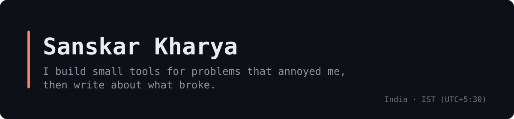

I work mostly in TypeScript, React and Node. Most of what I make starts with something that annoyed me: a .mov file that wouldn't open, a news feed with too much noise, an AI assistant that interrupts at the worst moment.

## Things I've shipped

| Project | What it does | Links |
|---|---|---|
| **[mov2mp4](https://github.com/MaybeSomeone-arc18/mov2mp4)** | Converts MOV to MP4 on your own machine with FFmpeg. No uploads, no file limits. Windows and Apple Silicon builds. | [writeup](https://dev.to/sansk_ya/what-i-learned-shipping-a-tiny-ffmpeg-desktop-app-1hng) |
| **[Saartheye](https://github.com/MaybeSomeone-arc18/saartheye-ai)** | Prototype of a browser-only navigation aid: camera in, on-device object detection, spatial audio out. | [prototype](https://saartheye-ai.vercel.app) · [writeup](https://dev.to/sansk_ya/the-guide-that-sees-for-you-building-an-on-device-navigation-companion-in-the-browser-2g0g) |
| **[IMA](https://github.com/MaybeSomeone-arc18/Ima-)** | Seven tech feeds in one place, with clustering, bookmarks and Ask IMA for cited answers. Its AI chat now has one entry point with a Groq-to-Gemini fallback. | [live](https://ima-tech.vercel.app/) |
| **[Cognitive Companion](https://github.com/MaybeSomeone-arc18/cognitive-companion-openenv)** | An OpenEnv environment for training agents on *when* to step in, not just what to say. | [demo](https://huggingface.co/spaces/MaybeSomeone19/cognitive-companion-openenv) |
| **[TaskFlow AI](https://github.com/MaybeSomeone-arc18/taskflow-ai)** | Project planning and progress tracking for small teams. React, Express, MongoDB, Gemini. | [live](https://taskflow-ai-nine.vercel.app) |
| **[Freelance Tax Copilot India](https://github.com/MaybeSomeone-arc18/freelance-tax-copilot-india)** | A Sanity Challenge entry that answers Indian freelancers’ tax questions using official sources. | [live](https://freelance-tax-copilot-india.vercel.app) |

I keep a [daily dev log](https://github.com/MaybeSomeone-arc18/daily-dev-activity) of what I build and learn.

Fuko, an opportunity finder, is [still in progress](https://github.com/MaybeSomeone-arc18/fuko).

## Building with my team

**KabadiwalaConnect** - our Smart India Hackathon project, still in progress. I've worked on the FastAPI backend, the Flutter app core and the offline sync engine.

## Open source

I've started contributing upstream:

- [pgadmin-org/pgadmin4#10451](https://github.com/pgadmin-org/pgadmin4/pull/10451) - the Change Server Password dialog now respects pgpass files, with tests
- [ZecHub/zechub#2217](https://github.com/ZecHub/zechub/pull/2217) - a new wiki page on avoiding common Zcash scams

## Stack

## Writing

Short posts on things I built and what I'd do differently: [dev.to/sansk_ya](https://dev.to/sansk_ya)
